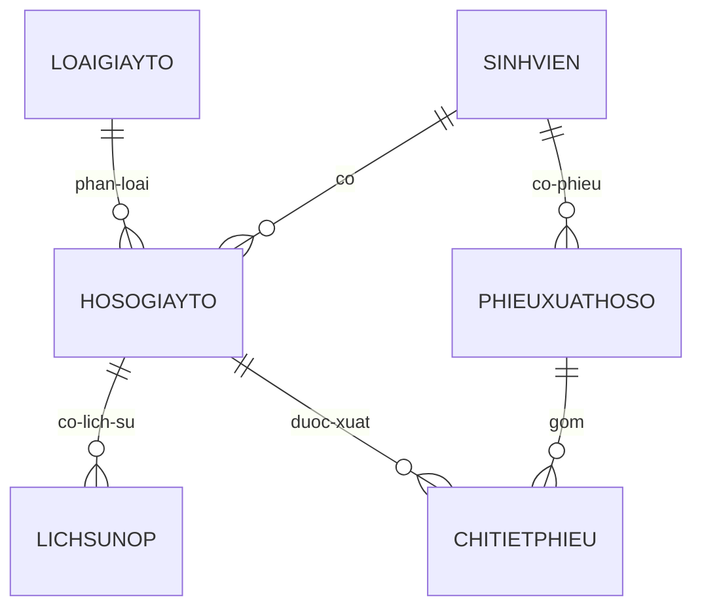

# AGENTS.md

> Tài liệu ngữ cảnh chuẩn cho AI coding agent và developer làm việc trên VWA EduRecords.

## Mục lục

1. [Tổng quan dự án](#1-tổng-quan-dự-án)
2. [Cấu trúc thư mục](#2-cấu-trúc-thư-mục)
3. [Tech stack](#3-tech-stack)
4. [Mô hình dữ liệu (ERD)](#4-mô-hình-dữ-liệu-erd)
5. [Quy tắc nghiệp vụ bắt buộc](#5-quy-tắc-nghiệp-vụ-bắt-buộc)
6. [Coding convention](#6-coding-convention)
7. [Cách chạy dự án](#7-cách-chạy-dự-án)
8. [Docker (khuyến nghị)](#8-docker-khuyến-nghị)
9. [Cách chạy không Docker](#9-cách-chạy-không-docker)
10. [Tài khoản mặc định](#10-tài-khoản-mặc-định)

---

## 1. Tổng quan dự án

- **Tên:** Website Quản lý hồ sơ sinh viên (VWA EduRecords).
- **Mục tiêu:** Quản lý tập trung hồ sơ cá nhân sinh viên, gồm thông tin cá nhân/học vụ, tình trạng giấy tờ, lịch sử nộp/bổ sung và mượn-trả-rút hồ sơ gốc.
- **Phạm vi:** Không bao gồm điểm số, học phí hoặc thời khóa biểu. Các phần này sẽ tích hợp sau qua MSSV.
- **Người dùng:** Chuyên viên đào tạo - tuyển sinh, vai trò Admin duy nhất. Giai đoạn hiện tại không có phân quyền nhiều cấp.
- **Giai đoạn:** MVP (Giai đoạn 1), gồm 4 module:
  - Danh sách hồ sơ.
  - Chi tiết hồ sơ (3 tab).
  - Mượn-Trả & Rút hồ sơ.
  - Lịch sử & Audit.
- **Tình trạng hiện tại trong repo:** Backend đã có đầy đủ module nghiệp vụ, entity, API, authentication (JWT). Frontend đã có React + Vite + TypeScript. Database schema và seed data đã có qua Flyway. Hỗ trợ Docker và Docker Compose.

## 2. Cấu trúc thư mục

```text
/
├── AGENTS.md
├── .gitignore
├── backend/
│   ├── pom.xml
│   ├── mvnw
│   ├── mvnw.cmd
│   ├── .mvn/wrapper/maven-wrapper.properties
│   └── src/
│       ├── main/
│       │   ├── java/vn/vwa/edurecords/
│       │   │   └── VwaEdurecordsApplication.java
│       │   └── resources/
│       │       ├── application.properties
│       │       ├── static/
│       │       └── templates/
│       └── test/java/vn/vwa/edurecords/
│           └── VwaEdurecordsApplicationTests.java
└── frontend/
    └── (đang trống)
```

- `backend/`: ứng dụng Spring Boot Maven `vwa-edurecords`.
- `src/main/java/vn/vwa/edurecords/`: package gốc của backend; `VwaEdurecordsApplication` là entry point với `@SpringBootApplication`.
- `src/main/resources/`: cấu hình và tài nguyên runtime. `application.properties` hiện chỉ có `spring.application.name`; `static/` và `templates/` chưa có file triển khai.
- `src/test/java/vn/vwa/edurecords/`: test backend; hiện có `VwaEdurecordsApplicationTests` với `contextLoads()`.
- `frontend/`: thư mục dành cho frontend nhưng hiện chưa có framework, source, cấu hình hoặc `package.json`.
- Các package layer chưa tồn tại trong repo. Khi triển khai, dùng convention dưới package gốc `vn.vwa.edurecords`:
  - `controller/`: REST controllers, chỉ nhận request/trả response và điều phối service.
  - `service/`: nghiệp vụ và transaction.
  - `repository/`: Spring Data repositories/truy cập dữ liệu.
  - `entity/`: JPA entities ánh xạ bảng dữ liệu.
  - `dto/`: DTO request/response, không expose entity trực tiếp qua API.
  - Có thể bổ sung `config/`, `exception/`, `mapper/` khi thực sự cần.

## 3. Tech stack

| Thành phần | Thực tế trong repo |
|---|---|
| Backend | Spring Boot `4.1.1`, Maven |
| Java | Java `25` |
| Web | `spring-boot-starter-webmvc` |
| Persistence | `spring-boot-starter-data-jpa` |
| Validation | `spring-boot-starter-validation` |
| Security | `spring-boot-starter-security`, JWT (JJWT 0.12.6) |
| Database | PostgreSQL 18, Flyway migrations |
| Cache | Spring Data Redis |
| Frontend | React 19, Vite 8, TypeScript |
| Container | Docker, Docker Compose |

### Ports mặc định

| Service | Port |
|---------|------|
| Backend API | 8081 |
| Frontend | 5173 |
| PostgreSQL | 5432 |
| Redis | 6379 |

## 4. Mô hình dữ liệu (ERD)

Đây là **đặc tả lõi của MVP**. Khi triển khai phải giữ đúng tên miền, khóa và quan hệ sau; kiểu dữ liệu cụ thể có thể chọn theo quy ước JPA/database đã thống nhất.

### Các bảng

| Bảng | Khóa | Cột/nghiệp vụ chính |
|---|---|---|
| `SINHVIEN` | PK: `MSSV` | Thông tin cá nhân, thông tin học vụ, `TrangThaiHocVu` gồm: `Đang học`, `Đã tốt nghiệp`, `Bảo lưu`, `Đã rút hồ sơ`, `Đình chỉ`. |
| `LOAIGIAYTO` | PK: `MaLoai` | Danh mục 13 loại giấy tờ; cờ `BatBuoc`, `DangSuDung`. |
| `HOSOGIAYTO` | PK: `MaHoSo`; FK: `MSSV`, `MaLoai` | Hồ sơ giấy tờ của sinh viên; `TrangThaiNop`, `BanGoc_BanSao`, `FileDinhKem`, `ViTriLuuKho`. |
| `LICHSUNOP` | PK: `MaLog`; FK: `MaHoSo` | Audit trail cho việc nộp/bổ sung giấy tờ. |
| `PHIEUXUATHOSO` | PK: `MaPhieu`; FK: `MSSV` | Phiếu dùng chung cho Mượn tạm thời và Rút hồ sơ vĩnh viễn; phân biệt qua `LoaiPhieu`. |
| `CHITIETPHIEU` | PK: `MaCT`; FK: `MaPhieu`, `MaHoSo` | Các giấy tờ thuộc từng phiếu xuất hồ sơ. |

### Quan hệ



- Một `SINHVIEN` có nhiều `HOSOGIAYTO` và `PHIEUXUATHOSO`.
- Một `LOAIGIAYTO` có thể được dùng trong nhiều `HOSOGIAYTO`.
- Một `HOSOGIAYTO` có nhiều bản ghi `LICHSUNOP` và có thể xuất hiện trong nhiều `CHITIETPHIEU` theo lịch sử nghiệp vụ.
- `PHIEUXUATHOSO` có nhiều `CHITIETPHIEU`; `CHITIETPHIEU` liên kết phiếu với từng hồ sơ giấy tờ.

## 5. Quy tắc nghiệp vụ bắt buộc

- “Đủ giấy tờ” chỉ tính trên 8/13 giấy tờ bắt buộc (STT 1-8); không tính 5 giấy tờ không bắt buộc.
- Mỗi lần tick/bỏ tick trạng thái nộp giấy tờ **phải** tự động sinh một bản ghi trong `LICHSUNOP`; không cho sửa trạng thái mà không lưu vết.
- Không cho tạo phiếu Mượn tạm thời nếu hồ sơ đang ở trạng thái `Đã rút hồ sơ`.
- Không cho tạo phiếu Rút hồ sơ vĩnh viễn khi còn giấy tờ khác đang `Đang mượn` chưa trả.
- Rút hồ sơ vĩnh viễn luôn áp dụng cho **toàn bộ** giấy tờ hiện có, không cho rút một phần.
- Hoàn tất Rút hồ sơ: khóa các thao tác chỉnh sửa thông thường trên hồ sơ và chuyển `TrangThaiHocVu = Đã rút hồ sơ`.
- Mọi thay đổi trạng thái phiếu hoặc hồ sơ phải ghi Lịch sử & Audit, không ghi đè dữ liệu cũ.
- Quá hạn trả của Mượn tạm thời phải được hệ thống tự động chuyển sang trạng thái `Quá hạn`, không thao tác thủ công.
- Kiểm tra các rule trên ở tầng Service, trong transaction phù hợp; Controller không tự thực hiện logic nghiệp vụ.

## 6. Coding convention

- Giữ package gốc `vn.vwa.edurecords` và đặt tên package theo layer: `controller`, `service`, `repository`, `entity`, `dto`.
- Code hiện có dùng:
  - Class/application/test: `PascalCase`, ví dụ `VwaEdurecordsApplication`.
  - Method và biến: `camelCase`, ví dụ `contextLoads`.
  - Hằng số, nếu có: `UPPER_SNAKE_CASE`.
- Entity dùng tên miền/bảng nhất quán với ERD; khóa ngoại và trạng thái phải được biểu diễn rõ ràng.
- API endpoint dùng danh từ tài nguyên, chữ thường và kebab-case khi cần; chưa có endpoint hiện hữu để làm chuẩn chi tiết hơn.
- Tuân thủ layer pattern: `Controller → Service → Repository → Entity`.
- Dùng DTO riêng cho request/response; không trả entity JPA trực tiếp từ API.
- Validate input và business rules ở Service; Controller chỉ xử lý giao thức HTTP, binding và chuyển tiếp.
- Ghi audit thay vì cập nhật đè khi nghiệp vụ yêu cầu lịch sử.
- Dùng Lombok chỉ khi phù hợp với style hiện tại; dependency Lombok đã có nhưng chưa được dùng trong source hiện hữu.
- Không sửa hoặc commit artifact sinh ra trong `target/`.

## 7. Cách chạy dự án

Có **2 cách** để chạy dự án:

### Cách 1: Docker (Khuyến nghị - đồng bộ cho cả team)

Xem chi tiết ở [mục 8](#8-docker-khuyến-nghị).

### Cách 2: Chạy trực tiếp trên máy

Xem chi tiết ở [mục 9](#9-cách-chạy-không-docker).

---

## 8. Docker (Khuyến nghị)

### Yêu cầu

- Docker Desktop đã cài đặt và đang chạy
- Docker Compose (tích hợp sẵn trong Docker Desktop)

### Setup nhanh

```bash
# 1. Clone repo
git clone <repo-url>
cd <repo-name>

# 2. Copy file môi trường
cp .env.example .env

# 3. Build và chạy tất cả services
docker-compose up -d

# 4. Kiểm tra trạng thái
docker-compose ps

# 5. Xem logs
docker-compose logs -f backend
```

### Các lệnh Docker thường dùng

```bash
# Xem trạng thái các services
docker-compose ps

# Xem logs tất cả
docker-compose logs -f

# Xem logs một service cụ thể
docker-compose logs -f backend
docker-compose logs -f frontend
docker-compose logs -f postgres

# Restart một service
docker-compose restart backend

# Dừng tất cả
docker-compose down

# Dừng và xóa data (reset database)
docker-compose down -v
docker-compose up -d

# Rebuild khi có thay đổi code
docker-compose up -d --build

# Rebuild chỉ một service
docker-compose up -d --build backend
```

### Cấu trúc Docker

| Service | Port | Mô tả |
|---------|------|--------|
| `postgres` | 5432 | Database PostgreSQL 18 |
| `redis` | 6379 | Cache cho JWT tokens & rate limiting |
| `backend` | 8081 | API Spring Boot (Java 25) |
| `frontend` | 5173 | Web React + Vite |

### Kiểm tra ứng dụng

- Frontend: http://localhost:5173
- Backend API: http://localhost:8081
- Backend Health: http://localhost:8081/actuator/health

### Cấu hình environment

Chỉnh sửa file `.env` để thay đổi:

```env
# Database
POSTGRES_USER=postgres
POSTGRES_PASSWORD=332003

# JWT Secret (THAY ĐỔI TRONG PRODUCTION!)
JWT_SECRET=VwaEduRecords2026SecretKeyJwt256bitsMinLengthRequired
```

---

## 9. Cách chạy không Docker

### Yêu cầu

- Java 25
- Node.js 22+
- PostgreSQL 18 (đã chạy sẵn)
- Redis (đã chạy sẵn)

### Chạy Backend

```powershell
cd backend

# Cài dependencies (lần đầu)
.\mvnw.cmd install

# Chạy ứng dụng
.\mvnw.cmd spring-boot:run

# Hoặc chạy test
.\mvnw.cmd test

# Build package
.\mvnw.cmd clean package

# Chạy executable JAR
java -jar target/vwa-edurecords-0.0.1-SNAPSHOT.jar --server.port=8081
```

### Chạy Frontend

```powershell
cd frontend

# Cài dependencies (lần đầu)
npm install

# Chạy development server
npm run dev

# Build production
npm run build
```

### Cấu hình Backend (không Docker)

Chỉnh sửa `backend/src/main/resources/application.properties`:

```properties
# Database - đổi URL, username, password nếu cần
spring.datasource.url=jdbc:postgresql://localhost:5432/vwa_edurecords?sslmode=disable
spring.datasource.username=postgres
spring.datasource.password=332003

# Redis
spring.data.redis.host=localhost
spring.data.redis.port=6379

# Port
server.port=8081
```

### Cấu hình Frontend (không Docker)

Tạo file `frontend/.env`:

```env
VITE_API_BASE_URL=http://localhost:8081
```

---

## 10. Tài khoản mặc định

Sau khi chạy Flyway migration, có sẵn:

| Username | Password | Role |
|----------|----------|------|
| Kieuvanson | 332003 | STAFF |

Đăng nhập tại: http://localhost:5173 (hoặc http://localhost:3000)

---

## Phụ lục: Cấu trúc file Docker

```text
/
├── docker-compose.yml      # Docker Compose configuration
├── .env.example            # Template biến môi trường
├── backend/
│   ├── Dockerfile          # Container cho Spring Boot
│   └── .dockerignore       # Ignore files khi build backend
└── frontend/
    ├── Dockerfile          # Container cho React/Vite
    └── .dockerignore       # Ignore files khi build frontend
```