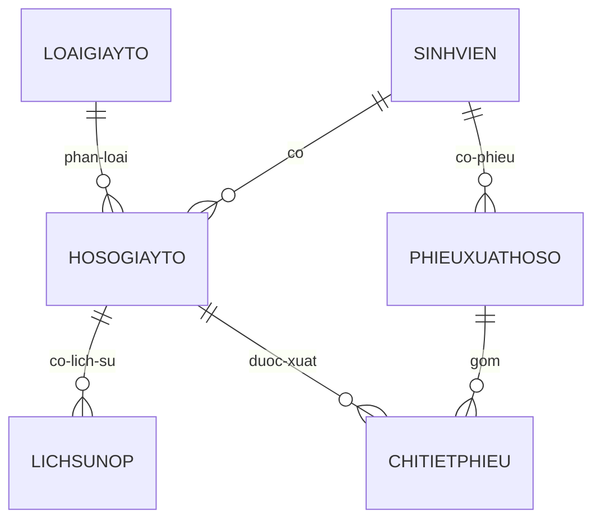

# AGENTS.md

> Tài liệu ngữ cảnh chuẩn cho AI coding agent làm việc trên VWA EduRecords. Repo hiện ở trạng thái skeleton Spring Boot; các phần được đánh dấu **đặc tả MVP** là yêu cầu cần triển khai, chưa phải chức năng đã có trong code.

## 1. Tổng quan dự án

- **Tên:** Website Quản lý hồ sơ sinh viên (VWA EduRecords).
- **Mục tiêu:** Quản lý tập trung hồ sơ cá nhân sinh viên, gồm thông tin cá nhân/học vụ, tình trạng giấy tờ, lịch sử nộp/bổ sung và mượn-trả-rút hồ sơ gốc.
- **Phạm vi:** Không bao gồm điểm số, học phí hoặc thời khóa biểu. Các phần này sẽ tích hợp sau qua MSSV.
- **Người dùng:** Chuyên viên đào tạo - tuyển sinh, vai trò Admin duy nhất. Giai đoạn hiện tại không có phân quyền nhiều cấp.
- **Giai đoạn:** MVP (Giai đoạn 1), gồm 4 module:
  - Danh sách hồ sơ.
  - Chi tiết hồ sơ (3 tab).
  - Mượn-Trả & Rút hồ sơ.
  - Lịch sử & Audit.
- **Tình trạng hiện tại trong repo:** Backend mới có application class, một test kiểm tra context và cấu hình tên ứng dụng; chưa có module nghiệp vụ, entity, API hoặc giao diện frontend.

## 2. Cấu trúc thư mục

```text
/
├── AGENTS.md
├── .gitignore
├── backend/
│   ├── pom.xml
│   ├── mvnw
│   ├── mvnw.cmd
│   ├── .mvn/wrapper/maven-wrapper.properties
│   └── src/
│       ├── main/
│       │   ├── java/vn/vwa/edurecords/
│       │   │   └── VwaEdurecordsApplication.java
│       │   └── resources/
│       │       ├── application.properties
│       │       ├── static/
│       │       └── templates/
│       └── test/java/vn/vwa/edurecords/
│           └── VwaEdurecordsApplicationTests.java
└── frontend/
    └── (đang trống)
```

- `backend/`: ứng dụng Spring Boot Maven `vwa-edurecords`.
- `src/main/java/vn/vwa/edurecords/`: package gốc của backend; `VwaEdurecordsApplication` là entry point với `@SpringBootApplication`.
- `src/main/resources/`: cấu hình và tài nguyên runtime. `application.properties` hiện chỉ có `spring.application.name`; `static/` và `templates/` chưa có file triển khai.
- `src/test/java/vn/vwa/edurecords/`: test backend; hiện có `VwaEdurecordsApplicationTests` với `contextLoads()`.
- `frontend/`: thư mục dành cho frontend nhưng hiện chưa có framework, source, cấu hình hoặc `package.json`.
- Các package layer chưa tồn tại trong repo. Khi triển khai, dùng convention dưới package gốc `vn.vwa.edurecords`:
  - `controller/`: REST controllers, chỉ nhận request/trả response và điều phối service.
  - `service/`: nghiệp vụ và transaction.
  - `repository/`: Spring Data repositories/truy cập dữ liệu.
  - `entity/`: JPA entities ánh xạ bảng dữ liệu.
  - `dto/`: DTO request/response, không expose entity trực tiếp qua API.
  - Có thể bổ sung `config/`, `exception/`, `mapper/` khi thực sự cần.

## 3. Tech stack

| Thành phần | Thực tế trong repo |
|---|---|
| Backend | Spring Boot parent `4.1.1`, Maven |
| Java | Java `25` (`<java.version>25</java.version>` trong `pom.xml`) |
| Web | `spring-boot-starter-webmvc` |
| Persistence | `spring-boot-starter-data-jpa` |
| Validation | `spring-boot-starter-validation` |
| Security | `spring-boot-starter-security` |
| Database driver | PostgreSQL runtime dependency đã có trong `pom.xml` |
| Dev/test | Spring Boot DevTools, Lombok, các starter test tương ứng |
| Frontend | Chưa xác định framework: `frontend/` trống, không có `package.json` |
| Database config | Chưa cấu hình. `application.properties` chưa có JDBC URL, username, password, dialect hay migration config. PostgreSQL hiện chỉ là database dự kiến theo dependency. |

## 4. Mô hình dữ liệu (ERD)

Đây là **đặc tả lõi của MVP**. Khi triển khai phải giữ đúng tên miền, khóa và quan hệ sau; kiểu dữ liệu cụ thể có thể chọn theo quy ước JPA/database đã thống nhất.

### Các bảng

| Bảng | Khóa | Cột/nghiệp vụ chính |
|---|---|---|
| `SINHVIEN` | PK: `MSSV` | Thông tin cá nhân, thông tin học vụ, `TrangThaiHocVu` gồm: `Đang học`, `Đã tốt nghiệp`, `Bảo lưu`, `Đã rút hồ sơ`, `Đình chỉ`. |
| `LOAIGIAYTO` | PK: `MaLoai` | Danh mục 13 loại giấy tờ; cờ `BatBuoc`, `DangSuDung`. |
| `HOSOGIAYTO` | PK: `MaHoSo`; FK: `MSSV`, `MaLoai` | Hồ sơ giấy tờ của sinh viên; `TrangThaiNop`, `BanGoc_BanSao`, `FileDinhKem`, `ViTriLuuKho`. |
| `LICHSUNOP` | PK: `MaLog`; FK: `MaHoSo` | Audit trail cho việc nộp/bổ sung giấy tờ. |
| `PHIEUXUATHOSO` | PK: `MaPhieu`; FK: `MSSV` | Phiếu dùng chung cho Mượn tạm thời và Rút hồ sơ vĩnh viễn; phân biệt qua `LoaiPhieu`. |
| `CHITIETPHIEU` | PK: `MaCT`; FK: `MaPhieu`, `MaHoSo` | Các giấy tờ thuộc từng phiếu xuất hồ sơ. |

### Quan hệ



- Một `SINHVIEN` có nhiều `HOSOGIAYTO` và `PHIEUXUATHOSO`.
- Một `LOAIGIAYTO` có thể được dùng trong nhiều `HOSOGIAYTO`.
- Một `HOSOGIAYTO` có nhiều bản ghi `LICHSUNOP` và có thể xuất hiện trong nhiều `CHITIETPHIEU` theo lịch sử nghiệp vụ.
- `PHIEUXUATHOSO` có nhiều `CHITIETPHIEU`; `CHITIETPHIEU` liên kết phiếu với từng hồ sơ giấy tờ.

## 5. Quy tắc nghiệp vụ bắt buộc

- “Đủ giấy tờ” chỉ tính trên 8/13 giấy tờ bắt buộc (STT 1-8); không tính 5 giấy tờ không bắt buộc.
- Mỗi lần tick/bỏ tick trạng thái nộp giấy tờ **phải** tự động sinh một bản ghi trong `LICHSUNOP`; không cho sửa trạng thái mà không lưu vết.
- Không cho tạo phiếu Mượn tạm thời nếu hồ sơ đang ở trạng thái `Đã rút hồ sơ`.
- Không cho tạo phiếu Rút hồ sơ vĩnh viễn khi còn giấy tờ khác đang `Đang mượn` chưa trả.
- Rút hồ sơ vĩnh viễn luôn áp dụng cho **toàn bộ** giấy tờ hiện có, không cho rút một phần.
- Hoàn tất Rút hồ sơ: khóa các thao tác chỉnh sửa thông thường trên hồ sơ và chuyển `TrangThaiHocVu = Đã rút hồ sơ`.
- Mọi thay đổi trạng thái phiếu hoặc hồ sơ phải ghi Lịch sử & Audit, không ghi đè dữ liệu cũ.
- Quá hạn trả của Mượn tạm thời phải được hệ thống tự động chuyển sang trạng thái `Quá hạn`, không thao tác thủ công.
- Kiểm tra các rule trên ở tầng Service, trong transaction phù hợp; Controller không tự thực hiện logic nghiệp vụ.

## 6. Coding convention

- Giữ package gốc `vn.vwa.edurecords` và đặt tên package theo layer: `controller`, `service`, `repository`, `entity`, `dto`.
- Code hiện có dùng:
  - Class/application/test: `PascalCase`, ví dụ `VwaEdurecordsApplication`.
  - Method và biến: `camelCase`, ví dụ `contextLoads`.
  - Hằng số, nếu có: `UPPER_SNAKE_CASE`.
- Entity dùng tên miền/bảng nhất quán với ERD; khóa ngoại và trạng thái phải được biểu diễn rõ ràng.
- API endpoint dùng danh từ tài nguyên, chữ thường và kebab-case khi cần; chưa có endpoint hiện hữu để làm chuẩn chi tiết hơn.
- Tuân thủ layer pattern: `Controller → Service → Repository → Entity`.
- Dùng DTO riêng cho request/response; không trả entity JPA trực tiếp từ API.
- Validate input và business rules ở Service; Controller chỉ xử lý giao thức HTTP, binding và chuyển tiếp.
- Ghi audit thay vì cập nhật đè khi nghiệp vụ yêu cầu lịch sử.
- Dùng Lombok chỉ khi phù hợp với style hiện tại; dependency Lombok đã có nhưng chưa được dùng trong source hiện hữu.
- Không sửa hoặc commit artifact sinh ra trong `target/`.

## 7. Lệnh thường dùng

Chạy từ thư mục `backend/`:

```powershell
# Chạy ứng dụng bằng Maven Wrapper trên Windows
.\mvnw.cmd spring-boot:run

# Chạy toàn bộ test
.\mvnw.cmd test

# Build và chạy test/package
.\mvnw.cmd clean package

# Chạy bằng Maven đã cài sẵn (tương đương wrapper)
mvn spring-boot:run
mvn test
```

- Repo có `mvnw`, `mvnw.cmd` và Maven Wrapper `3.3.4`; ưu tiên wrapper để dùng đúng môi trường repo.
- Frontend chưa có `package.json`, nên hiện chưa có lệnh `npm run dev`, `npm run build` hoặc `npm test` thực tế để chạy. Chỉ bổ sung các lệnh này sau khi framework/frontend được tạo.
- Test hiện hữu là `VwaEdurecordsApplicationTests.contextLoads()`. Khi thêm nghiệp vụ, bổ sung test Service/API cho các business rules và audit bắt buộc.